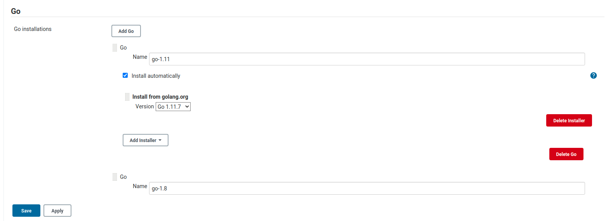
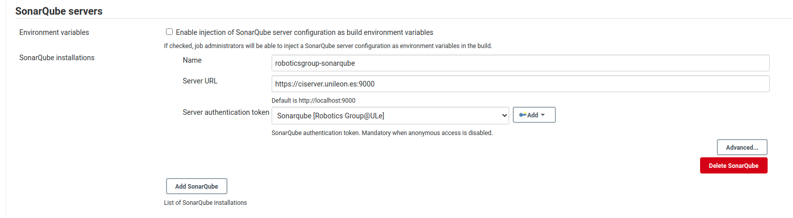
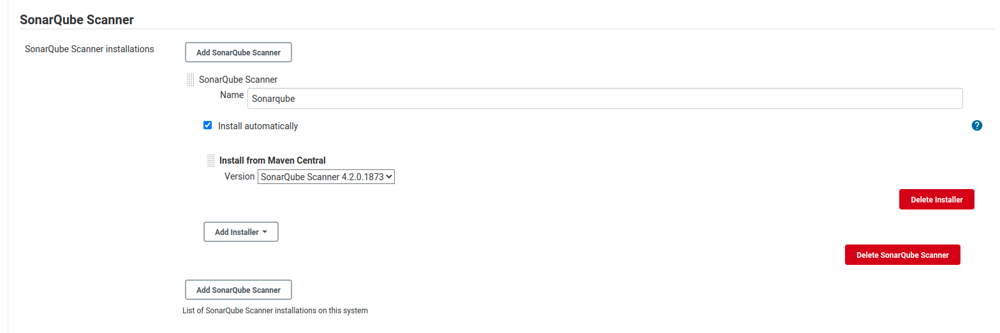

# CI Process -- GITLAB - JENKINS - SONARQUBE

## 1. GITLAB

Create a repoistory and put all the code in there. Tests should have its own folder (tests in this case)

## 2. JENKINS

In our case, for the pipeline we are using the Golang plugin so we don't have to install go itself. 

First, we select the tool. We are using go 1.11. We have to go to Global Tool Configuration -> Go. Select the Go version you want to install and put a name. The name is what we are going to use later to match the desired version.



Let's move to the Jenkins file. Specify that we are going to use the tool go with the name we wrote in the previous step.

```Jenkinsfile
pipeline {
    agent any
    
    tools {
        go 'go-1.11'
    }
    
    environment {
        GO111MODULE = 'on'
    }
```

Then, we set the gitlab connection we want to use and clone the repo. In our case, we are keeping it simple. We are just building the project and performing the tests.

```
   options {
        gitLabConnection('roboticsgroup-gitlab')
    }
    stages {
        stage('SCM Checkout') {
            steps {
                git([
                    url: 'https://niebla.unileon.es/DavidFerng/secdocker.git',
                    credentialsId: 'jenkins-gitlab'
                ])
            }
        }
        stage('Build') {
            steps {
                sh 'go build'
            }
        }
        stage('Test') {
            steps {
                sh 'go test -v ./tests'
            }
        }
```

### JENKINS INTEGRATION WITH GITLAB

Enable 'Build when a change is pushed to GitLab' so the build triggers every time you get a push to the Gitlab repository. Grab the Gitlab webhook URL, in the advanced tab generate an auth token and move to Gitlab. 

In the Settings->Integrations add the URL and the Secret Token and push the Test button to check everything is working.

## SONARQUBE

First step is to create a project and grab the name.

### SONARQUBE INTEGRATION WITH JENKINS
We need the Sonarqube plugins inside Jenkins. Once they are installed, we proceed to create our server.

Move to Configuration inside Jenkins and look for SonarQube Servers. You should fill the information according to the information related to your server.



Then, we are going to set up the SonarQube scanner. Move to Global Tool Configuration -> SonarQube Scanner.

Add a new configuration, put any name you want (we are using it later) and the version.



Finally, add the SonarQube part to the pipeline. The SCANNER_HOME name is the name you picked in the SonarQube Scanner part and the withSonarQubeEnv variable is the one you picked in the server part. PROJECT_NAME is the Sonarqube project and the ORGANIZATION variable depends on your configuration.

If you have set up an organization, write your organization name there. If you haven't, put 'default-organization'.

```
 stage('SonarCloud') {
          environment {
            SCANNER_HOME = tool 'Sonarqube'
            PROJECT_NAME = "secdocker"
            ORGANIZATION = "default-organization"
          }
          steps {
            withSonarQubeEnv('roboticsgroup-sonarqube') {
                sh '''$SCANNER_HOME/bin/sonar-scanner -Dsonar.organization=$ORGANIZATION \
                -Dsonar.java.binaries=build/classes/java/ \
                -Dsonar.projectKey=$PROJECT_NAME \
                -Dsonar.sources=.'''
            }
          }
        }
  
    }
    
    post {
        always {
            deleteDir()
        }
    }
}
```

*Full Jenkinsfile is inside the repository*