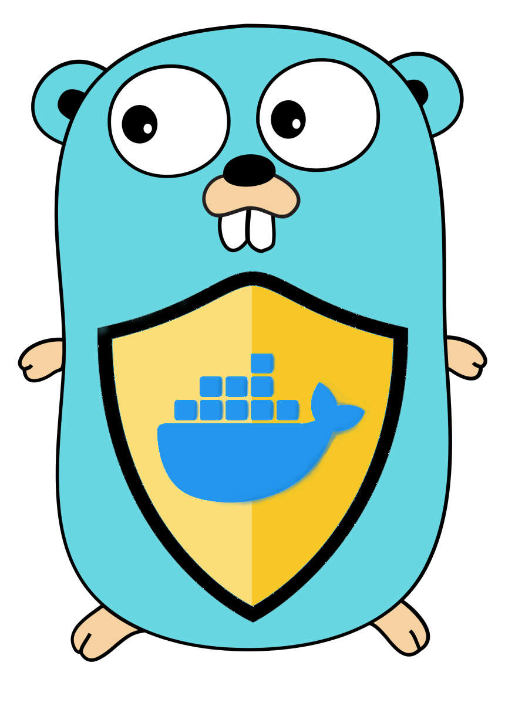
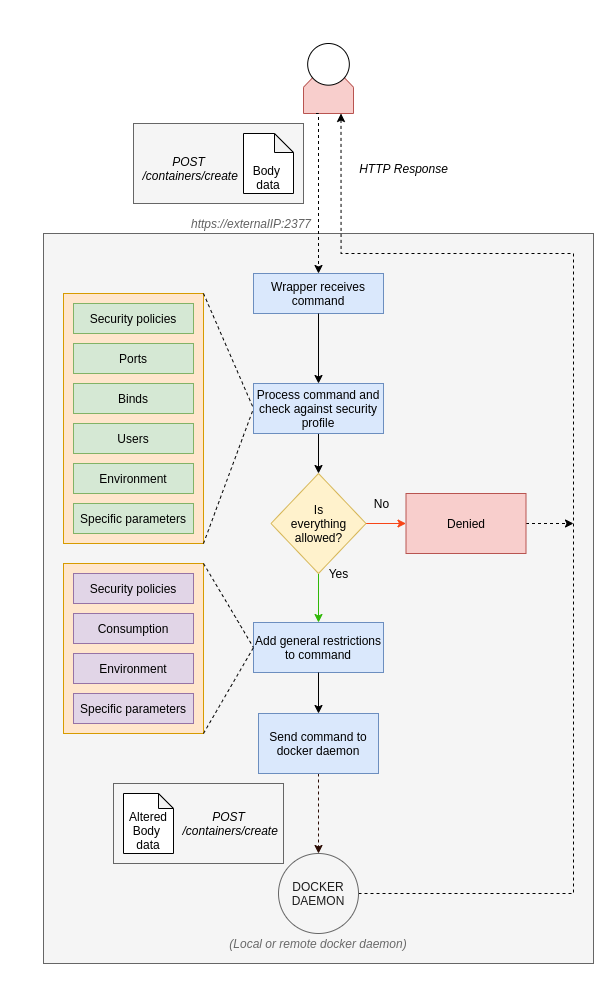
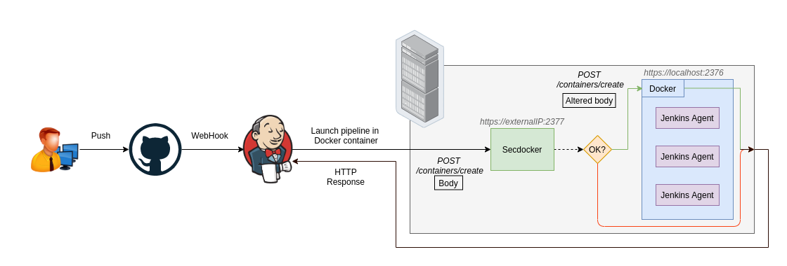
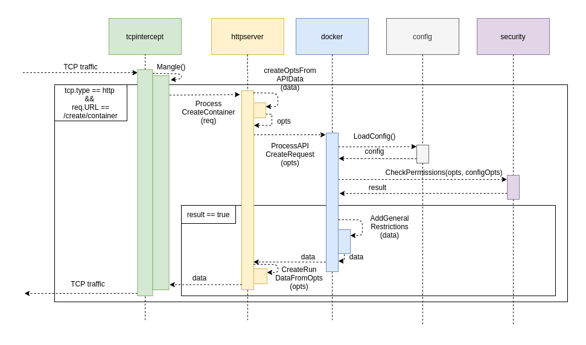

[](https://goreportcard.com/report/github.com/uleroboticsgroup/Secdocker) [](https://codecov.io/gh/uleroboticsgroup/Secdocker) [](https://opensource.org/licenses/MIT)

<p align="center">
<div style="text-align: center">



# SecDocker

</div>
</p>

**An application firewall for Docker**

## Description

SecDocker is a Go application that acts as a firewall for Docker. It's designed to receive all the traffic that goes to the Docker API / socket and drop the requests that contain unauthorized parameters. You can provide rules and specifications as well as general restrictions to be applied to every request, modifying the traffic as it goes to the Docker daemon.

This application is meant to run transparently. In order to work, you must redirect the traffic to this tool without modifiying it. The easiest way to do this (specially in a test environment) is by using `iptables`.

For example:

`sudo iptables -A PREROUTING -t nat -i eth0 -p tcp --dport 2376 -j REDIRECT --to-port 8999`

to redirect external traffic to SecDocker



## Config file

An example config file is provided in the repo as config.yml

The config file has the following fields:

* **plugins**

    The list of plugins to be loaded

* **restrictions**

    Here are the rules that SecDocker checks. If a run command contains any of the rules, the action is blocked.

    Available restrictions:
    * ports
    * users
    * mounts
    * environment
    * securitypolicies
    * images
    * privileged

* **general**

    This are the restrictions that are applied to each run instruction after it is checked.

    Available restrictions:
    * memory
    * cpu
    * user
    * environment

## Log file

A log file based on [Logrus](https://github.com/sirupsen/logrus) is written to secdocker.log containing information about every event that happens. This includes:

* Requests received
* Allowed requests
* Forbidden options requested

## Compile and run

- To compile: 

    `go build`

- To run:

    `./secdocker`

## Testing

To test the code run: 
```
go test `go list ./... | grep -v plugins` -v -cover -coverprofile=coverage.out
```

To obtain the coverage: 
```
go tool cover -func=coverage.out
```

## Plugins
Plugins are components that are independent from the original program. In our case, the only requirement is that the the plugins must be compiled with the current version of SecDocker in order to work.

To compile them: 

```
go build -buildmode=plugin -o plugin_name.so plugin_name.go
```

Plugins are called by using `Process(image string) bool` at the moment. In order to create your own plugin, you must implement this method inside the plugin. The bool response says if the plugin output states that the image is safe.

At the moment, we have 2 plugins:

* **Anchore**

    This plugin depends on a working anchore engine (https://hub.docker.com/r/anchore/anchore-engine). It will ask for an analysis of the image. All can be customized inside the config.yml file inside the anchore folder.

* **Notary**

    This plugin checks if the local image that is being run has the same digest as the remote image. 

## CI

The application is designed to be used in DevOps environments to provide a secure use of containers. An example diagram with Jenkins and Github / Gitlab is provided:



## Flow diagrams

### Blocked create container



## Credits

It was built at: https://seguridad.unileon.es/index.php/SecDocker

## Notes

The TCP proxy code (tcpintercept package) is a modified version of the one from the project [Trudy](https://github.com/praetorian-inc/trudy)
